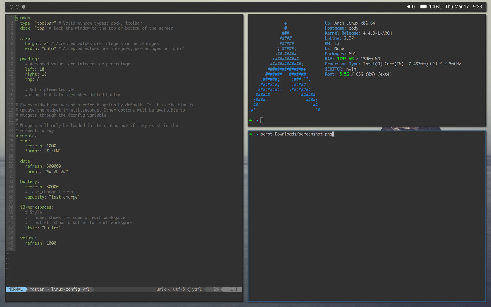

# Element

This is a cross platform status bar built on electron.

## Installation

```bash
# Install element-status
[sudo] npm i -g element-status

# Start the status bar
element
```

## Screenshot

<a href="https://raw.githubusercontent.com/callahanrts/element/master/screenshot/screenshot.jpg" target="_blank"></a>

## Configuration

```bash
~/.config/element/
├── config.yml   # Window and widget configuration
├── stylesheets/ # Custom styles using .less
└── widgets/     # Custom widgets for displaying various information
```
Example [`config.yaml`](https://github.com/callahanrts/element/tree/master/examples)

`config.yml` should be placed into your element configuration folder.

### Stylesheets
```
~/.config/element/stylesheets/
├── main.less
└── widget.less
```
All `.less` stylesheets in this directory will be loaded in the status bar alphabetically.
Widgets are added to the `.bar` div element. To get a view of the markup you can run
`element dev` to start element with the devTools (chrome console) open.

### Widgets
```
~/.config/element/widgets/
└── date.coffee
```

All widgets added to the widgets directory will be available to element. Widget files
will not be executed until they are added to the elements array in `config.yml`

To learn how to create widgets, we'll walk through an example:

```coffeescript
# date.coffee
# The Widget parent class is included in all widgets.
Widget = requireCoffee("#{widgets}/widget.coffee")

# require whatever modules your widget might need.
#   modules from your home directory can be required with:
#     module = require("#{@homePath}/node_modules/module")
#   modules from your `~/.config/element/` directory can be required with:
#     module = require("#{@configPath}/node_modules/module")
$ = require("jquery")
strftime = require('strftime')

module.exports =
class BarDate extends Widget

  # required
  constructor: ->
    # The string passed to super must match the name of your widget in the
    # config.yml. This will make your widget's config available in @config.
    # The window configuration from config.yml will be available in @window
    super("date")

  # This method will be called once immediately, and once after every
  # @config.refresh milliseconds
  update: =>
    super("date")
    $(".date").html @date()

  # required
  # This is the markup for your widget. The constructor will ensure that this
  # element gets appended to the .bar element
  element: =>
    """
    <div class="date" style="#{@style()}"></div>
    """

  # In this example, style is a css string that will be loaded as an inline
  # style for the .date element.
  style: =>
    """
    height: #{@window.size.height}px !important;
    line-height: #{@window.size.height}px !important;
    """

  # Method for retrieving/formatting the date.
  date: ->
    strftime(@config.format, new Date())
```
